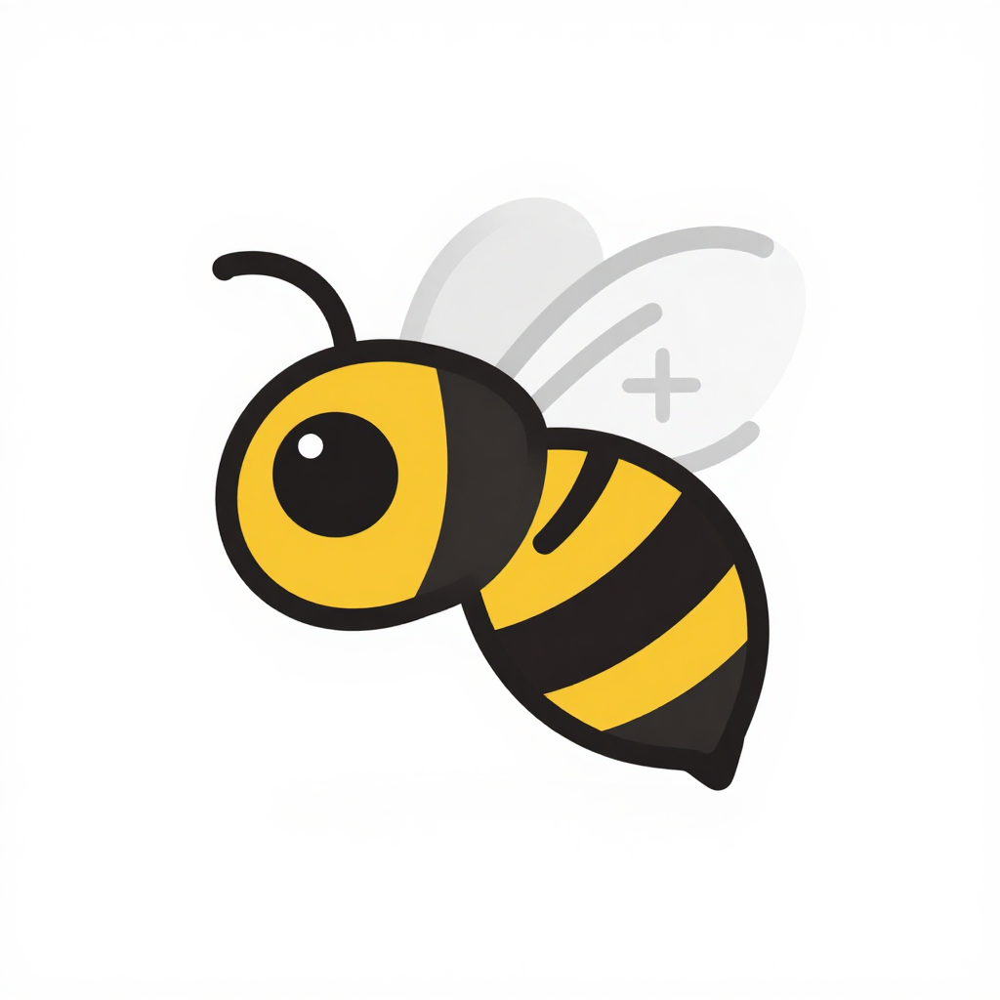

**简体中文** | [English](README.en.md)

<h2>BeePlayer</h2>

### 一、功能简述
- 一个自由、开源的**媒体播放器**与**多媒体引擎**，目标是播放一切、随处运行。
- 能够读取绝大多数多媒体文件、光盘、网络串流与采集设备，并可进行转码、录制、推流等处理。
- 内置可嵌入第三方应用的引擎 **libVLC**，提供 C、C++、Python、C# 等语言绑定。
- 支持 Windows、macOS、GNU/Linux、BSD、Android、iOS 等主流平台。

### 二、部署方式
1. 在支持的平台上安装对应发行包（Windows、macOS、Linux、Android、iOS）。
2. 开发者在自己的应用中集成 libVLC，即可获得播放、转码和串流能力。

### 三、使用教程
1. 打开 BeePlayer，通过“媒体”菜单打开文件、光盘、网络串流或采集设备。
2. 使用内置播放列表、字幕、音视频均衡器、皮肤与可视化等功能。
3. 命令行方式：`vlc [选项] <文件或流地址>`。
4. 远程控制可启用 HTTP 界面或 telnet CLI 界面。

### 四、接口文档
1. libVLC 公共 API
    - C 头文件位于 `include/vlc`。
    - 引擎源码位于 `lib/` 与 `src/`。
2. 语言绑定
    - C、C++、Python、C# 等绑定位于 `bindings/`。
3. 插件与模块
    - `modules/` 包含编解码器、封装、音频/视频输出、访问模块等插件体系。

### 五、专注的点
- 全格式覆盖与稳定播放。
- 同一引擎跨平台运行。
- 引擎可嵌入第三方程序，允许外部应用保持自己的许可证。
- 自由软件生态，所有源码可审阅、可修改。

### 六、开发进度
- [X] 多媒体文件播放
- [X] 光盘与网络串流支持
- [X] 转码、录制与推流
- [X] 跨平台 GUI（桌面、移动端、Web 控制台）
- [X] libVLC 嵌入式引擎
- [X] 插件化编解码与访问架构

### 七、许可证
- BeePlayer 本体采用 GPLv2（或更新版本）授权。
- libVLC 引擎采用 LGPLv2（或更新版本）授权，可嵌入第三方应用。

### 八、贡献与社区
- 欢迎通过 Merge Request 贡献代码；参与前请先解决 CI 与讨论中的问题。
- 社区成员包括开发者、打包者、文档编写者、设计师与支持人员。
- 相关资源：[BeePlayer 支持](https://www.videolan.org/support/)、[论坛](https://forum.videolan.org/)、[Wiki](https://wiki.videolan.org/)、[Bug 跟踪](https://code.videolan.org/videolan/vlc/-/issues)。

### 九、从源码构建

- 各平台的编译步骤、依赖与配置项见 [INSTALL](INSTALL) 文件。
- 需要自行编译时，请按该文件准备对应平台的工具链后再执行构建。
